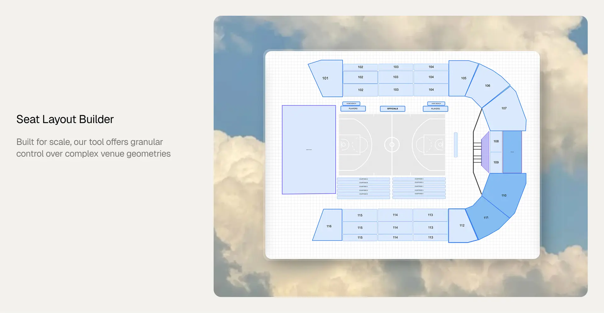

# Seat Layout



Design a venue once, run many shows against it, and sell seats safely even under heavy concurrency.

- **Visual editor** for designing venues.
- **Customer renderer** for browsing and picking seats.
- **Go REST API** backed by PostgreSQL as the system of record.

```
seat-layout/
├── apps/
│   ├── web/   Next.js 15 / React 19 editor and customer renderer
│   └── api/   Go REST API, the system of record
├── Makefile
├── docker-compose.yml
└── .env.example
```

## Quick start

You'll need Go 1.22+, Node with pnpm, and Docker for Postgres.

```bash
# 1. Database
make db-up          # start Postgres and wait until it's healthy
make migrate        # apply schema migrations

# 2. API → http://localhost:8080
make api-dev

# 3. Web → http://localhost:3000
cp .env.example apps/web/.env.local
make web-install
make web-dev
```

Confirm it's alive with `curl http://localhost:8080/healthz`, which returns `{"data":{"status":"ok"}}`.

## The apps

### apps/api

The Go REST API and system of record.

- **Stack:** Go standard library (net/http with the Go 1.22 ServeMux); pgx/v5 is the only outside dependency; PostgreSQL is the system of record.
- **Layered architecture:** handler → service → store → postgres, all resting on a pure domain package that handles seat flattening and validation.
- **Consistent responses:** one envelope everywhere — `{"data": …}` on success, `{"error": {"code","message"}}` on failure.
- **Safe concurrency:** holds and bookings use `SELECT … FOR UPDATE`, so a seat can never be sold twice.
- **Partner-friendly:** a stable resource model and a flat seat inventory endpoint let partners integrate without parsing the editor's scene graph.
- **Auth:** sits behind an `AUTH_ENABLED` flag but does nothing yet.
- **Reference:** the full endpoint list lives in `apps/api/README.md`.

### apps/web

The Next.js editor and renderer.

- **Editor** at `/editor/{layoutId}` — design venues visually with rows (lines or arcs), seats, tables, standing sections, shapes, text, and images. Saving sends the scene to the API, which derives the flat seat list.
- **Renderer** at `/seat-layout/{layoutId}?ssId={showId}` — the customer view, joining a layout with availability and pricing for each show.
- **Config:** point it at the API with `NEXT_PUBLIC_API_BASE_URL`.
