# Seat Layout UI - Component Architecture Diagram

```mermaid
graph TB
    subgraph "Application Entry Points"
        RootLayout["layout.js<br/>Root layout wrapper"]
        HomePage["page.js<br/>Home page"]
        EditorPage["editor/page.js<br/>Main editor entry point"]
        EditorScreenPage["editor/[screenId]/page.js<br/>Editor with screen ID"]
        SeatLayoutPage["seat-layout/[screenId]/page.js<br/>Seat layout viewer"]
    end

    subgraph "Editor Application"
        EditorProvider["EditorProvider<br/>Context provider for editor state"]
        EditorContext["EditorContext<br/>React context for editor state management"]
        EditorReducer["reducer.js<br/>State reducer for editor actions"]
        EditorActions["actions.js<br/>Action creators"]
        
        EditorLayout["EditorLayout<br/>Main editor layout container"]
        TopBar["TopBar<br/>Top navigation with import/export"]
        Toolbar["Toolbar.js<br/>Tool selection sidebar"]
        CanvasStage["CanvasStage.js<br/>Main canvas rendering component"]
        PropertiesPanel["PropertiesPanel.js<br/>Right sidebar for properties"]
    end

    subgraph "Canvas Rendering System"
        Renderers["canvas/renderers.js<br/>Rendering functions:<br/>- Grid, Seats, Rows<br/>- Elements, Boundaries<br/>- Selection, Drawing preview"]
        ToolPreview["canvas/toolPreview.js<br/>Tool preview rendering"]
        HitTest["canvas/hitTest.js<br/>Hit testing for interactions"]
        Geometry["geometry.js<br/>Geometric calculations:<br/>- Arc/line geometry<br/>- Seat positioning<br/>- Curve calculations"]
    end

    subgraph "Editor Components"
        ShortcutsModal["components/ShortcutsModal.js<br/>Keyboard shortcuts help"]
        Tooltip["components/Tooltip.js<br/>Tooltip component"]
        
        subgraph "Properties Components"
            SceneProperties["SceneProperties<br/>Scene-level settings"]
            RowProperties["RowProperties<br/>Row editing panel"]
            SeatProperties["SeatProperties<br/>Seat editing panel"]
            ElementProperties["ElementProperties<br/>Element editing panel"]
            ActionsPanel["ActionsPanel<br/>Action buttons panel"]
            CategoriesPanel["CategoriesPanel<br/>Seat category management"]
            SectionsPanel["SectionsPanel<br/>Section management"]
            SeatSettings["SeatSettings<br/>Global seat settings"]
            ToolProperties["ToolProperties<br/>Tool-specific settings"]
            UIComponents["UIComponents.js<br/>Shared UI components"]
        end
    end

    subgraph "Seat Layout Viewer"
        SeatLayoutComponent["SeatLayout Component<br/>Main viewer component"]
        
        subgraph "Viewer Components"
            SeatLegend["SeatLegend.js<br/>Legend for seat types"]
            SeatBottomBar["SeatBottomBar.js<br/>Bottom bar with selection info"]
            StandingSectionModal["StandingSectionModal.js<br/>Standing section purchase modal"]
            StandingSectionTicket["StandingSectionTicket.js<br/>Standing ticket component"]
        end
        
        subgraph "SVG Elements"
            SeatElement["SeatElement.js<br/>SVG seat rendering"]
            CircleElement["CircleElement.js<br/>SVG circle rendering"]
            RectangleElement["RectangleElement.js<br/>SVG rectangle rendering"]
            TextElement["TextElement.js<br/>SVG text rendering"]
            ImageElement["ImageElement.js<br/>SVG image rendering"]
        end
    end

    subgraph "Custom Hooks - Editor"
        UseSeatTypes["useSeatTypes.js<br/>Fetch and manage seat types"]
        UseDebounceCallback["useDebounceCallback.js<br/>Debounce callback utility"]
    end

    subgraph "Custom Hooks - Viewer"
        UseSeatLayout["useSeatLayout.js<br/>Fetch and process layout data"]
        UseSeatSelection["useSeatSelection.js<br/>Manage seat selection state"]
        UseViewportControls["useViewportControls.js<br/>Viewport pan/zoom controls"]
        UseStandingSection["useStandingSection.js<br/>Standing section modal state"]
        UseSeatColors["useSeatColors.js<br/>Calculate seat colors"]
        UseFPS["useFPS.js<br/>FPS monitoring"]
    end

    subgraph "Utilities - Editor"
        Types["types.js<br/>Type definitions and creators:<br/>- TOOL_TYPES, ELEMENT_TYPES<br/>- createRow, createSeat, createElement"]
        SVGImport["svgImport.js<br/>SVG file import functionality"]
    end

    subgraph "Utilities - Viewer"
        ColorUtils["colorUtils.js<br/>Color manipulation utilities"]
        Constants["constants.js<br/>Viewer constants"]
        CoordinateUtils["coordinateUtils.js<br/>Coordinate transformations"]
        GeometryUtils["geometryUtils.js<br/>Geometric calculations"]
        SeatUtils["seatUtils.js<br/>Seat-related utilities"]
    end

    subgraph "Services"
        ApiService["services/api.js<br/>API service for data fetching"]
    end

    RootLayout --> HomePage
    RootLayout --> EditorPage
    RootLayout --> EditorScreenPage
    RootLayout --> SeatLayoutPage

    EditorPage --> EditorProvider
    EditorProvider --> EditorContext
    EditorContext --> EditorReducer
    EditorContext --> EditorActions
    
    EditorPage --> EditorLayout
    EditorLayout --> TopBar
    EditorLayout --> Toolbar
    EditorLayout --> CanvasStage
    EditorLayout --> PropertiesPanel

    CanvasStage --> Renderers
    CanvasStage --> ToolPreview
    CanvasStage --> HitTest
    CanvasStage --> Geometry
    CanvasStage --> UseSeatTypes

    PropertiesPanel --> SceneProperties
    PropertiesPanel --> RowProperties
    PropertiesPanel --> SeatProperties
    PropertiesPanel --> ElementProperties
    PropertiesPanel --> ActionsPanel
    PropertiesPanel --> CategoriesPanel
    PropertiesPanel --> SectionsPanel
    PropertiesPanel --> SeatSettings
    PropertiesPanel --> ToolProperties
    PropertiesPanel --> UIComponents

    Toolbar --> ShortcutsModal
    Toolbar --> Tooltip

    SeatLayoutPage --> SeatLayoutComponent
    SeatLayoutComponent --> UseSeatLayout
    SeatLayoutComponent --> UseSeatSelection
    SeatLayoutComponent --> UseViewportControls
    SeatLayoutComponent --> UseStandingSection
    SeatLayoutComponent --> UseSeatColors
    SeatLayoutComponent --> UseFPS
    
    SeatLayoutComponent --> SeatLegend
    SeatLayoutComponent --> SeatBottomBar
    SeatLayoutComponent --> StandingSectionModal
    SeatLayoutComponent --> StandingSectionTicket
    
    SeatLayoutComponent --> SeatElement
    SeatLayoutComponent --> CircleElement
    SeatLayoutComponent --> RectangleElement
    SeatLayoutComponent --> TextElement
    SeatLayoutComponent --> ImageElement

    UseSeatLayout --> ApiService
    UseSeatTypes --> ApiService
    UseStandingSection --> SeatUtils

    CanvasStage --> Types
    PropertiesPanel --> Types
    Toolbar --> Types
    
    Renderers --> Types
    Geometry --> Types
    
    SeatLayoutComponent --> ColorUtils
    SeatLayoutComponent --> Constants
    SeatLayoutComponent --> CoordinateUtils
    SeatLayoutComponent --> GeometryUtils
    SeatLayoutComponent --> SeatUtils

    TopBar --> SVGImport

    style EditorProvider fill:#8d6fbf,color:#fff
    style CanvasStage fill:#4a90e2,color:#fff
    style SeatLayoutComponent fill:#7ed321,color:#fff
    style ApiService fill:#f5a623,color:#fff
    style EditorReducer fill:#e94b3c,color:#fff
```

## Component Descriptions

### Application Entry Points
- **layout.js**: Root Next.js layout wrapper
- **page.js**: Home page
- **editor/page.js**: Main editor entry point with keyboard handlers
- **editor/[screenId]/page.js**: Editor page with specific screen ID
- **seat-layout/[screenId]/page.js**: Seat layout viewer page

### Editor Core
- **EditorProvider/EditorContext**: React context for global editor state
- **reducer.js**: Redux-like reducer for state management
- **actions.js**: Action creators for state updates
- **CanvasStage**: Main canvas component handling rendering and interactions
- **Toolbar**: Left sidebar with tool selection buttons
- **PropertiesPanel**: Right sidebar for editing selected items
- **TopBar**: Top navigation with import/export functionality

### Canvas System
- **renderers.js**: All canvas rendering functions (grid, seats, rows, elements, boundaries)
- **toolPreview.js**: Preview rendering for active tools
- **hitTest.js**: Hit testing for mouse interactions
- **geometry.js**: Geometric calculations for arcs, lines, and seat positioning

### Editor Components
- **ShortcutsModal**: Modal showing keyboard shortcuts
- **Tooltip**: Reusable tooltip component
- **Properties Components**: Various panels for editing scene, rows, seats, elements, etc.

### Seat Layout Viewer
- **SeatLayout Component**: Main viewer component
- **SeatLegend**: Legend showing seat types and colors
- **SeatBottomBar**: Bottom bar with selection information
- **StandingSectionModal**: Modal for purchasing standing section tickets
- **SVG Elements**: Components for rendering different SVG element types

### Hooks
- **Editor Hooks**: useSeatTypes, useDebounceCallback
- **Viewer Hooks**: useSeatLayout, useSeatSelection, useViewportControls, useStandingSection, useSeatColors, useFPS

### Utilities
- **types.js**: Type definitions and factory functions
- **svgImport.js**: SVG import functionality
- **Viewer Utils**: Color, coordinate, geometry, and seat utilities

### Services
- **api.js**: API service for fetching seat layout and seat type data

